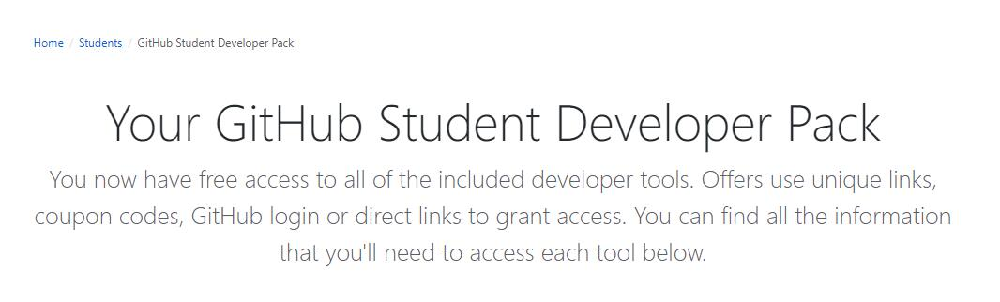

# GitHub 学生包使用指南

 1. 学生包账号(通过学生证或其他手段得到)
 2. 信用卡(大多数情况下不支持虚拟卡,预付卡)/Paypal 账号
 3. 编程能力,如果没有编码能力的话,学生包里七八成的东西都用不起来.
 4. 部分服务不支持国内使用,就看大家本事了.(原生IP)
 5. 工具是用于提高效率的,合理利用,不适宜用于牟利.
 6. **希望大家不要盯着服务器类产品用,有非常多的其他产品,价值都很高.**
 7. **目前GH学生包提供94项福利,你又用了多少呢**
 

------
# 相关链接

 - [GitHub学生包主页][1]
 - [关于GitHub学生包][2]
 - [GitHub 学生包新成员][3]
 - [GitHub学生包又更新了!][4]
 - [GH学生包又双叒叕更新了][5]

------
# 学习资源

 - SymfonyCasts:3个月PHP开发课程.
 - FrontendMasters:6个月Web开发课程.
 - Flatiron School:1个月Web开发课程,有社区支持.
 - OneMonth:1个月Web开发课程.
 - Covalence:1个月Atomic Plan,还有一对一辅导,编程学习网站.
 - GoRails:1年Ruby Web开发课程.
 - Educative:6个月编程学习课程.
 - InterviewCake:3个星期的代码提升训练,编程问答,经验总结,推荐使用.
 - Thinkful:1个月Web开发课程,学习工具.
 - DataCamp:为了更好的利用数据?似乎是技能学习平台,3个月免费.

------
# 公众免费

 - GitHub:无限公开代码库/私有代码库,现在所有人都可以享受.
 - Atom:所有人都可以用的IDE,开源免费.
 - GitHub Desktop:所有人都可以用的工具,一个GitHub的桌面软件,使用体验和GitHub网站差不多.

------
# 域名服务

 - Namecheap:1年SSL证书(SSL优惠码) + 1年的免费域名(.me) + 需要学生邮箱二次验证.
 - .TECH:1年的免费域名(.tech),管理面板较为古老,但是人家是注册局,另外需要注册的也可以给我留言,免费帮忙注册.TECH(需要自行先注册.TECH账号)
 - Name.com:1 年 SSL 证书(绑定) + 1 年的免费域名(超多后缀).

------
# 虚拟主机/PaaS/VPS/云主机/服务器托管/微服务

 - Heroku:2年Hobby Dyno(需要绑定信用卡),速度不佳,但是可以整个月的运行,已经激活,赠送赠金必须24个月内用完,否则作废.
 - EducationHost:1年免费虚拟主机,配额较低,1G流量+1G储存,带数据库,带邮箱账号.(实测不限制流量/空间)
 - MNX.io:150美金优惠券,全托管VPS,但是申请较为困难.(适合正规应用,不适宜中专业务,LXC架构)
 - DigitalOcean:50美元优惠券,只能用于新用户,使用后有效期一年.
 - ~~Microsoft Azure:100美金优惠券(风控严格),需要干净手机号,干净IP申请.(优惠码)~~
 - Microsoft Azure:100美金优惠(风控严格),绑定GitHub账号,并随时验证(需2020年2月之后申请的账号
 - Amazone AWS:100美金的Stater(可能不同机构托管)账号,有学生证的上啊,没有的迟早也要二审,二审不过就杀,参加网络考试并正确可以获得额外积分([考试积分][6]/[网络延迟][7])
 - Netwise:1年服务器托管,需要自备服务器,寄过去费用比什么都高.(基本没用)
 - Storyscript:~~一年Business Plan,微服务引擎.(每月10美金配额限制)~~,暂时无法申请.

------
# 移动应用

 - HazeOver:订阅授权,让你更专注地使用苹果电脑上的应用,应用只在美区Mac商店,实测就是个后台软件自动变暗功能.(赠送一个授权密钥:🚐🏁🍗😅🐈👳😵🐖💧👼🚫👫📼😪🌟🚴)
 - WorkingCopy:免费Pro Plan,水果手机的Git客户端,~~没有水果手机没测试过.~~必须美区账号,但是由于墙原因,并不是很好用.

------
# 服务器管理套件

 - LogDNA:日志分析服务,一年期,每个月50GB储存,日志储存14天,支持API方式推送日志.(50G储存能包含很多日志了.)
 - AstraSecurity:6个月网站防火墙服务和免费病毒扫描,支持WordPress集成.
 - SQLSmash:订阅授权,针对微软SQL服务器的优化工具,可以简化SQL语句的编写.
 - Termius:SSH/SFTP管理工具,免费高级计划,支持手机补全,多端同步.
 - Datadog:Pro Account 2年,服务器监视工具,就像给VPS上一个云平台一样的面板.
 - EverSQL:6个月授权,SQL自动优化工具.
 - PopSQL:协作式的SQL编辑器(有在线版和客户端版),编写查询,可视化数据并共享结果,可以在线连接远端数据库,其实也支持Mongodb之类的.
 - SimpleAnalytics:网站统计,类似以前CNZZ什么的,可以免费1年隐藏统计数据,创建时候不能选Private,但是后续可以选.
 - SQLGate:SQL IDE,据说很强大,1年标准订阅.(目前授权失效)
 
------
# 私有库支持

 - GitKraken:1年专业版,这是最高版本,支持私有仓库,支持冲突编辑,和GitKraken Glo配对使用.
 - GitKraken Glo:1年专业版,任务看板工具,和GitKraken配对使用.
 - Travis CI:增加私有代码库支持,持续集成工具.
 - Gitpod:6个月Personal Plan,100小时免费,附加私有库支持.
 - Codecov:私有代码库支持,用于分析代码完善度,是否有完善的测试案例等等.
 - BetterCodeHub:私有代码库支持,用于分析代码完善度,是否有完善的测试案例等等.
 - CodeScene:私有仓库支持,检查代码中是否存在风险.
 - Coveralls:私有库支持(10个/1年),代码覆盖率检查,不显示任何订阅,但是确实可以看到私有库并操作.
 - DeepScan:分析JavaScript脚本靠不靠谱的平台,6个月,需要GitHub创建对应repo.
 - DeepSource:给Python和Go的代码静态分析,检查错误,安全分析的工具,Pro订阅.
 - Imgbot:私有库支持,自动优化Repo里的图片,大概最没存在感,全自动的,以PR方式提交修稿.
 - Restyled:私有仓库支持,让你每个提交看起来很强迫症(符合格式),要brittany.yaml文件指导.
 - Tower:Git客户端,Pro订阅,1年期.

------
# 邮件服务

 - Mailgun:1年内,每月2万封电子邮件推送和100封免费电子邮件验证.
 - Testmail:免费Essential Plan,可以接收无限邮件数,邮件保留3天.
 - SendGrid:每天200封电子邮件推送,一个月最多15K封,风控较为严格,全程需代理访问.(目前无法授权,授权后依然是Free 100.)

------
# 翻译集成

 - Transifex:翻译管理工具,Starter Plan 6个月,要自己具备外语知识.(通用优惠码:GITHUBDEV19,没有学生包也能用.)
 - Phrase:翻译管理工具,Lite Plan 6个月.
 - Weglot:1年Pro Plan,翻译管理,但是包含了自动翻译和人工修正,每个月可以翻译20万词.
 - Crowdin:1年Bronze Plan,翻译管理工具.
 - Lingohub:翻译管理,1万字,也是一个要自己翻的工具.
 - POEditor:翻译管理,1万字,是个编辑器,编辑语言包的.

------
# 应用集成

 - Vaadin:免费专业版订阅,Java的Web开发框架.(不属于订阅,属于Student Developer program.)
 - Bootstrap Studio:订阅授权,前端框架Bootstrap的可视化开发工具.(密钥智能激活一台机)
 - PushBots:6个月Premium账号,支持浏览器和手机推送工具,也可以集成在App内.(似乎推送时好时坏.)
 - Wisej:1年的Wisej订阅,支持3台电脑,用于.NET的Web开发.(会显示学生License)
 - Algolia:搜索工具,10万条记录和100万条操作,支持集成WordPress,有效期1年.
 - Transloadit:免费Startup Plan,可以免费处理10GB数据,文件转码工具.
 - NetLicensing:免费Basic Plan,网络授权服务,激活服务器,发布自己的软件用的.(人工二审.)
 - Cryptolens:免费的授权服务器,支持发行10个密钥,支持无限用户.
 
------
# 开发集成

 - JetBrains:订阅授权,用学生邮箱每年都能申请,每年需要续订.(普通EDU邮箱也可以申请)
 - Sentry:每月500,000次活动事件,跟踪程序错误的工具,找BUG工具.
 - Honeybadger:1年的订阅,用来捕获程序错误分析的.
 - Blackfire:免费Profiler订阅,代码性能监测工具,类似Facebook XHProf.
 - ConfigCat:1000个功能标记,不限用户数量.(类似网络版宏定义,修改一些定义,程序中靠这些定义工作,SDK里面只能GET标记,SET标记就要登录后台.)
 - BrowserStack:1年Automate Mobile Plan,兼容Selenium,支持手机APP测试.
 - CARTO:赠送数据库存储,实时数据,位置数据服务积分和高级功能2年.(有示例数据,操作类似SQL)
 - Kaltura:VPaaS视频云,每年赠与1万礼金,为期2年,但是操作基本靠API,流畅度也较低,但是国外流畅度很高,支持1080p以下视频转码,不支持H265.
 - Appfigures:1年Grow Plan,App商店数据分析工具.
 - AccessLint:自动化的Web可访问性测试引入您的开发工作流程,大概就是增加私有库支持吧,暂时无法登录.(价值49美金/月,无限期)
 - Datree:规范化Git提交,每次提交前自动化检查一些内容,Pro订阅.(336美金/每年,无限期)
 - LambdaTest:浏览器测试,跟BrowserStack很类似,,自动化集成用的也是Selenium,一年订阅.(似乎没Preview版本浏览器)
 - SOFY:又是自动化测试,但是这个似乎针对移动平台的,Browserstack也有针对移动平台的支持,但是这个说自己是加入了机器学习(人工智障?)的测试平台,只有6个月免费,测试时间也小于Browserstack好多.
 - Themeisle:页面生成器,其实是一个很牛逼的WP主题.

------
# 开发工具

 - Next.tech:1年云计算环境,容器化的,不持久,配置较低,但是速度较好,用于学习一流,支持在线版VSC,感觉良好,通过再注册12个号还可以给自己延期.
 - Repl.it:1年Hacker Plan,无限私有项目,并且可以邀请很多人一起编程.
 - Adafruit:我记得这个是个做模块的,怎么也合作了,大概就是买某些板子30%折扣,还有一个Adafruit IO(IOT平台),给的折扣码.

------
# 设计资源

 - Canva:1年Canva's Pro订阅,海报制作工具,非常多的素材.
 - Icons8:3个月内可以下载所有图标,照片.插图和音乐.
 - Iconscout:1年内,每个月可以下载60个高级图标.
 - Typeform:1年Professional Plan,创建交互式表单的工具.(需要绑卡.)
 - Pageclip:免费表单工具,给自己的静态网站添加表单功能.

------
# 桌面软件

 - USETogether:6个月Premium订阅,但是每6个月可以重新续期.
 - PomoDone:2年Pomodone Lite计划,事件记录,流程记录工具.(需要桌面APP,日程记录安排跟踪工具.)

------
# 杂项

 - Stripe:收钱工具,前1000美金收款不收手续费.(需美国公司信息激活.)
 - Scrapinghub:1个永久免费的爬虫,无限的团队成员,项目或请求,爬虫支持1小时的抓取时间,并且数据保留7天.(暂时无法激活.)
 - GitHub校园专家:支持用户在校园内建立技术社区,对于普通人用途不大,需要审核.
 - Luminati:提供代理IP的软件(4000万个),100美金额度,但是全部屏蔽国内流量,国内连注册都成问题,得到的代理IP也是屏蔽国内IP.

  [1]: https://education.github.com/pack/offers
  [2]: https://www.taterli.com/5612/ 
  [3]: https://www.taterli.com/5777/
  [4]: https://www.taterli.com/6011/
  [5]: https://www.taterli.com/6413/
  [6]: https://www.taterli.com/wp-content/uploads/2020/02/%E5%BE%AE%E4%BF%A1%E5%9B%BE%E7%89%87_20200201221902.jpg
  [7]: http://ping.edufree.me/
